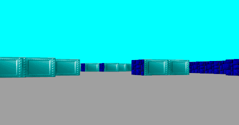

<h1>🕹️ 42-Cub3d 🕹️</h1>
</img>

Cub3D is a <a href="https://www.42network.org/">42 School</a> project that involves creating a simple 3D raycasting prototype inspired by classic like Doom and Wolfenstein 3D. Written in C using the <a href="https://github.com/codam-coding-college/MLX42">MiniLibX</a> graphic library

<h2>✅ Features ✅</h2>
<ul>
  <li>Custom raycasting engine</li>
  <li>Customizable maps with walls, floor, and ceiling colors</li>
  <li>Texture mapping for walls based on wall orientation</li>
  <li>Player movement</li>
  <li>Camera rotation with arrow keys</li>
  <li>Collision detection</li>
  <li>Map parsing</li>
</ul>

<h2>🛠️ Compilation and usage 🛠️</h2>
<h3>Dependencies</h3>
MLX's dependencies: glfw (or glfw-wayland for wayland)

For Debian:

```Bash
sudo apt install libglfw3
```

For Arch (x11):
```Bash
sudo pacman -S glfw-x11
```
For Arch (Wayland):
```Bash
sudo pacman -S glfw-wayland
```


<h3>Build</h3>
Clone the repository

```Bash
git clone https://github.com/princess-mikus/42-cub3d.git cub3d
```
And then call the Makefile

```Bash
make
```
<h3>Usage</h3>

```Bash
./cub3d map_path
```
where map_path is the path of a valid map. Example maps are in the maps folder (valid for valid maps, error for error handling showcase)
